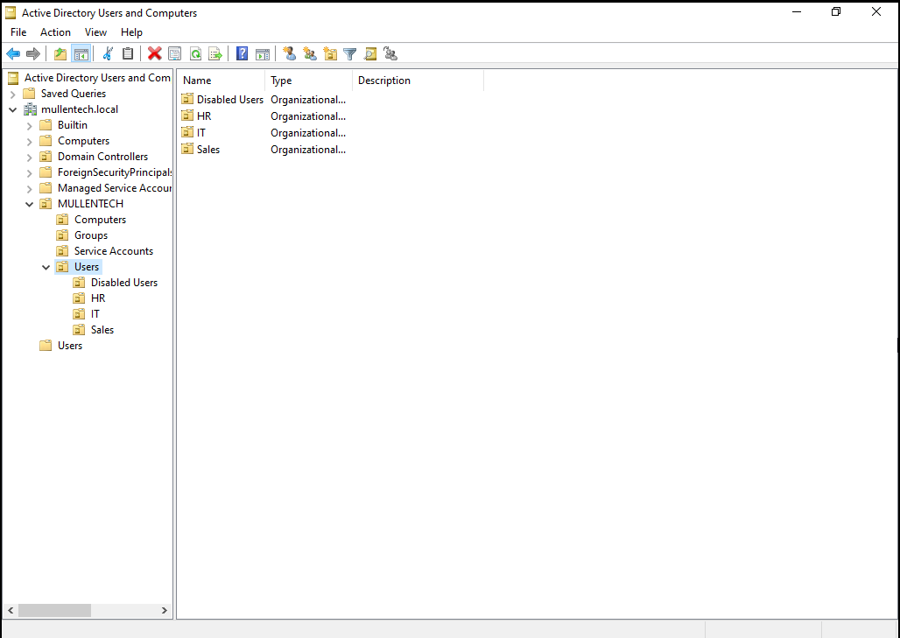

# active-directory-home-lab
Windows Server 2022 Active Directory home lab featuring AD DS, Group Policy, DNS, DHCP, file shares, mapped drives, and help desk ticket simulations.
# Active Directory Home Lab

## Project Overview

This project documents the setup of a Windows Server 2022 Active Directory home lab designed to simulate a small business IT environment. The lab demonstrates common IT Technician and Help Desk responsibilities, including user management, domain joining, Group Policy, DHCP, DNS, file shares, mapped drives, and troubleshooting.

## Lab Environment

* Windows Server 2022
* Windows 11 Pro Client
* VMware Workstation
* Active Directory Domain Services
* DNS
* DHCP
* Group Policy Management
* File Sharing and NTFS Permissions

## Organizational Unit Structure

The following image shows the business OU hierarchy used in the lab.

## Domain

Domain Name: `mullentech.local`

Server Name: `SERVER1`

Client Name: `PC1`

## Active Directory Structure

Created a business-style OU structure:

* MullenTech

  * Users

    * IT
    * HR
    * Sales
  * Groups
  * Computers
  * Service Accounts

## Security Groups

Created department-based security groups:

* IT_Admins
* HR_Users
* Sales_Users
* Restricted_Users

## Key Configurations

### Active Directory

* Promoted Windows Server 2022 to a Domain Controller.
* Created users, OUs, and security groups.
* Joined Windows 11 client computer to the domain.
* Tested domain login with multiple user accounts.

### Group Policy

Configured Group Policy Objects for:

* Password policy
* Desktop wallpaper
* Restricted Control Panel access
* Department-based mapped network drives

### DHCP and DNS

* Configured DHCP scope for client IP assignment.
* Verified client received IP address from SERVER01.
* Configured DNS for domain resolution.

### File Shares

Created department file shares using Share and NTFS permissions.

Example:

* Sales shared folder mapped as `S:` drive for Sales users

## Help Desk Ticket Simulations

Performed common IT support tasks:

* Password reset
* Account unlock
* New user onboarding
* Employee termination
* Group membership change
* Domain computer deployment
* Group Policy refresh
* Mapped drive troubleshooting

## Skills Demonstrated

* Active Directory administration
* Windows Server administration
* User and group management
* Group Policy configuration
* DHCP and DNS setup
* Windows 11 domain join
* File share and permission management
* Help Desk troubleshooting
* Technical documentation

## Screenshots

Screenshots are included in the `/screenshots` folder to document the lab setup and completed tasks.

## Lessons Learned

Building this Active Directory home lab provided valuable hands-on experience with Windows Server administration and troubleshooting. Several issues encountered during the project helped reinforce important concepts and best practices:

* Learned the importance of renaming a server before promoting it to a Domain Controller after experiencing trust relationship and Netlogon issues caused by renaming the server post-promotion.
* Developed a better understanding of DNS and its critical role in domain communication and workstation authentication.
* Gained experience troubleshooting Group Policy Objects (GPOs), including policy scope, security filtering, and policy application verification using `gpresult`.
* Learned how share permissions and NTFS permissions work together to control access to network resources.
* Configured and validated DHCP scopes and automatic IP address assignment for domain clients.
* Troubleshot mapped drive deployment and verified network share accessibility.
* Built and tested common Help Desk scenarios including password resets, account unlocks, user onboarding, group membership changes, and workstation deployment.
* Strengthened problem-solving skills by diagnosing and resolving issues through research, testing, and iterative troubleshooting.

This project reinforced the importance of planning, documentation, and systematic troubleshooting while providing practical experience with technologies commonly used in enterprise IT environments.

## Conclusion

This project demonstrates practical hands-on experience with core IT support and systems administration tasks commonly performed in Help Desk, Desktop Support, and IT Technician roles.
